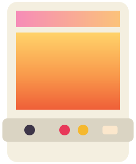
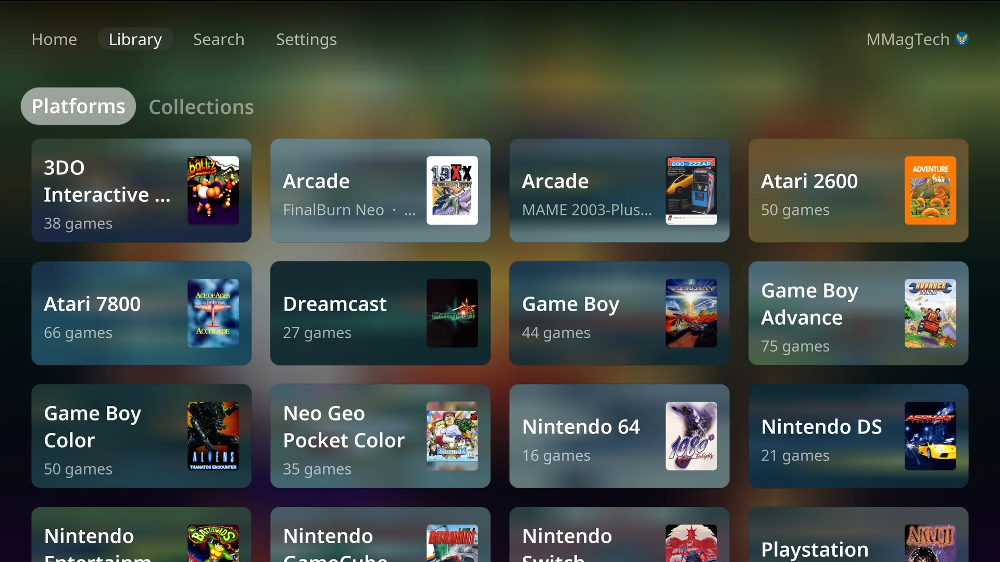
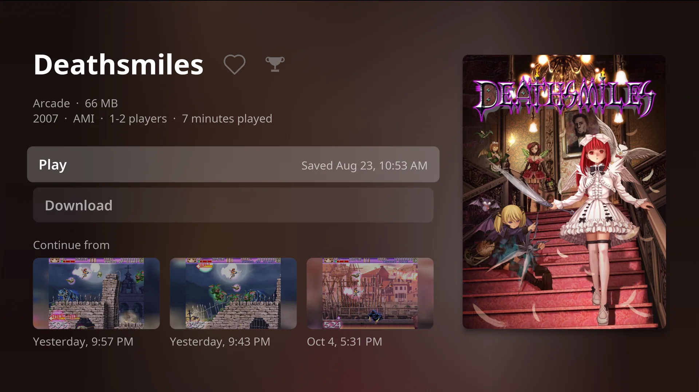
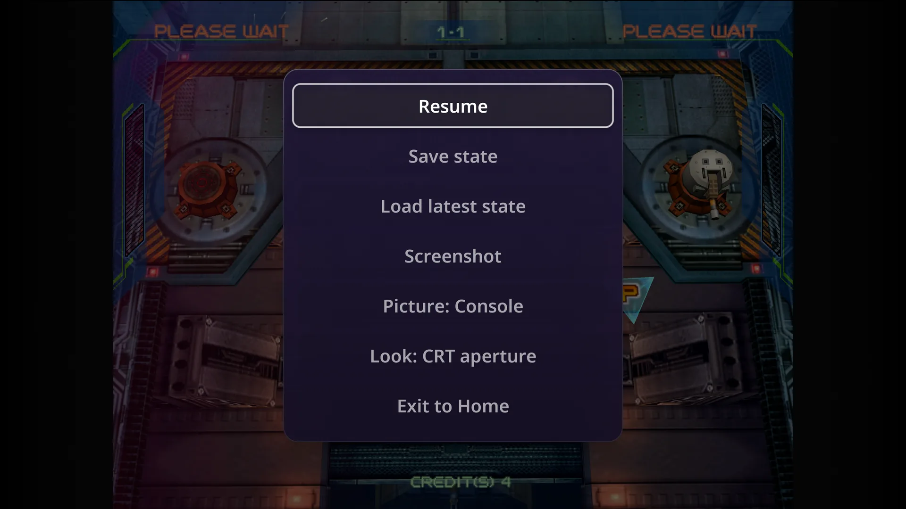
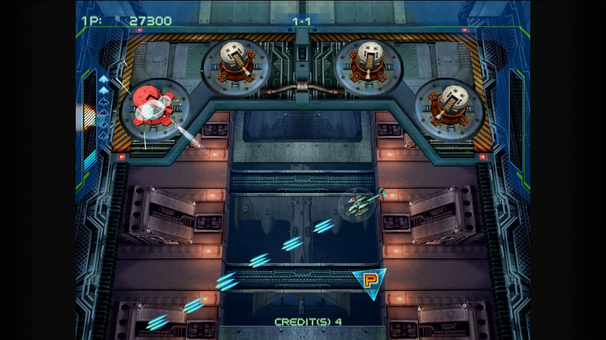
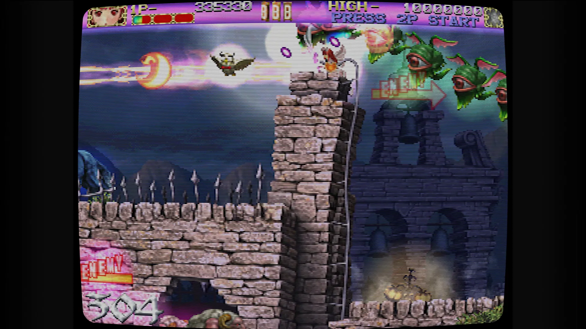
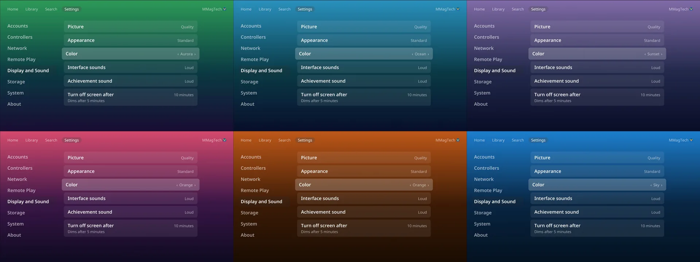

<h1 align="center">CabinetOS</h1>

<b>Your whole game library, on the TV, as a console.</b> 
33 systems, from the Atari 2600 to the Switch, played from your own
<a href="https://github.com/rommapp/romm">RomM</a> server with one controller.

<a href="https://mmagtech.github.io/cabinetos/"><b>See it in action</b></a> ·
<a href="https://mmagtech.github.io/cabinetos/wiki/">Wiki</a> ·
<a href="docs/wiki/install.md">Install</a> ·
<a href="docs/wiki/systems.md">Systems and BIOS</a>

CabinetOS turns a small PC into a games console. It starts straight into its
own menus, and from there a controller does everything. Games, covers, BIOS and
saves all live on your RomM server, so the console is only ever a screen away
from your whole library.

- **Pick up where you left off.** Saves and save states go to RomM by
  themselves, and every game page shows your last three states with a picture.
- **Every system tuned.** An emulator chosen and set up for each of 33 systems,
  rendering up to 4K, with one pause menu in every game.
- **Make it look right.** CRT and LCD looks per system, and sixteen colours for
  the menus, bright ones included.
- **Everyone their own.** Each person signs in with a QR code and gets their own
  saves, favourites, play time, achievements and colour. A PIN guards the rest.
- **Four players, real Wii Remotes**, and your Miis in every Wii game.
- **Play from your phone** with Moonlight, at home or away over Tailscale.
- **Steam, too.** Hand the TV to Steam's Big Picture and come back.
- **Updates in one press**, as a single image.

| | | |
|---|---|---|
|  |  |  |
|  |  |  |

Every picture here was captured from a running console. The
[showcase page](https://mmagtech.github.io/cabinetos/) has the videos.

## What you need

- **A small PC** with AMD Radeon graphics. CabinetOS is built and tested on the
  **GEEKOM A9 Pro**, the only machine it has been tested on so far.
- **A RomM server**, 5.1 or newer, with your games, BIOS and firmware.
- **A controller**, Bluetooth or USB, and a USB keyboard for the first run.
- **A TV.**

## Get started

The [wiki](https://mmagtech.github.io/cabinetos/wiki/) goes from a blank PC to
playing: [install](docs/wiki/install.md), [first run](docs/wiki/first-run.md),
[your RomM server](docs/wiki/romm.md), then everything else. There is no
release download yet; the [install page](docs/wiki/install.md#get-the-installer)
says where the installer comes from today.

## Credits and licence

CabinetOS's own source is MIT licensed. See [`LICENSE`](LICENSE).

**The emulators it ships are not, and some are free for non-commercial use
only.** [`docs/LICENCES.md`](docs/LICENCES.md) lists every one, its licence,
its source and the exact version it was built from. **CabinetOS is free, is not
sold, and takes no donations**: that is what keeps those emulators legitimate in
this build, and it is deliberate.

CabinetOS ships no games, no BIOS and no keys. All of them come from your own
RomM server.

CabinetOS is built on [Bazzite](https://github.com/ublue-os/bazzite) and
[Universal Blue](https://universal-blue.org); its look comes from
[Cabinet](https://github.com/MMagTech/cabinet), the Apple TV app. The
`Containerfile`, `Justfile`, `disk_config/` and `.github/workflows/` are derived
from the [Universal Blue image template](https://github.com/ublue-os/image-template)
(Apache-2.0).

---

## Working on CabinetOS

- [`docs/WORKING.md`](docs/WORKING.md): the machines, the build and test loop,
  how the image is built and how CI works.
- [`docs/PROJECT.md`](docs/PROJECT.md): the specification.
- [`docs/ROADMAP.md`](docs/ROADMAP.md): the order of work.
- [`docs/lessons/`](docs/lessons/README.md): what cost hours before.

CabinetOS is a [bootc](https://bootc-dev.github.io/bootc/) image on Bazzite.
**Nothing builds on a Mac**: every image is built by GitHub Actions, and the
console's own frontend is in [`frontend/`](frontend/).

The showcase page and the wiki are in [`docs/`](docs/) (`index.html` and
`wiki/`), served by GitHub Pages from `main`. Changes under `docs/` never build
an image, except `docs/LICENCES.md`.
