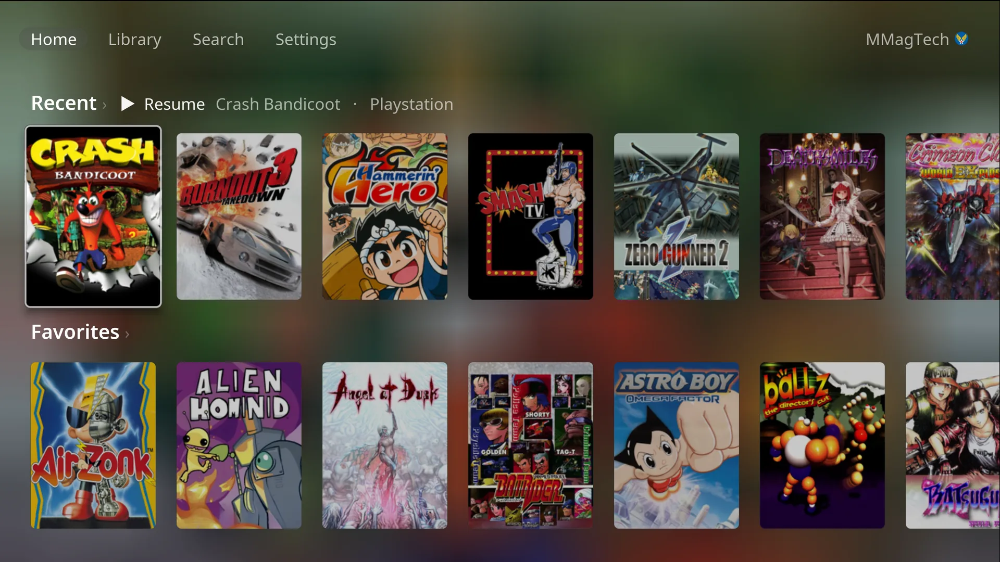

# CabinetOS wiki

How to set up CabinetOS and use every part of it. Start at the top and you go
from a blank PC to playing.

## Set it up

1. [Install](install.md): what you need, the installer, the one question it asks.
2. [First run](first-run.md): network, your RomM server, pairing, a controller.
3. [Your RomM server](romm.md): what the console reads from it, and how to lay it out.
4. [Controllers and Bluetooth](controllers.md): pads, Wii Remotes, players.
5. [Wi-Fi and network](network.md)
6. [Drives and storage](drives.md): extra drives, downloads, space.

## Play

- [The library](library.md): Home, the Library, Search and a game's page.
- [The pause menu](pause-menu.md)
- [Saves, states and sync](saves.md)
- [Players and accounts](players.md): everyone their own, and the PIN.
- [Screenshots](screenshots.md)
- [Achievements](achievements.md)

## Settings

- [Picture and colours](picture.md): picture levels, screen looks, colours, dark hours.
- [Remote Play](remote-play.md): play from a phone, tablet or computer.
- [Steam](steam.md)
- [Updates](updates.md)
- [File access](file-access.md): copy files to and from the console.

## Reference

- [Buttons and shortcuts](navigation.md): every screen, and the in-game shortcuts.
- [Systems, formats and BIOS](systems.md): what plays, which files, which BIOS.
- [When something is wrong](troubleshooting.md)

## In one paragraph

CabinetOS is a console operating system for a small PC under the TV. It starts
straight into its own menus, plays 33 systems with emulators chosen and set up
for each, and takes every game, cover, BIOS and save from your own
[RomM](https://github.com/rommapp/romm) server. A controller does everything
after the first run. It is built on [Bazzite](https://bazzite.gg) and updates
itself as a single image. The only machine it has been tested on is the
GEEKOM A9 Pro.
