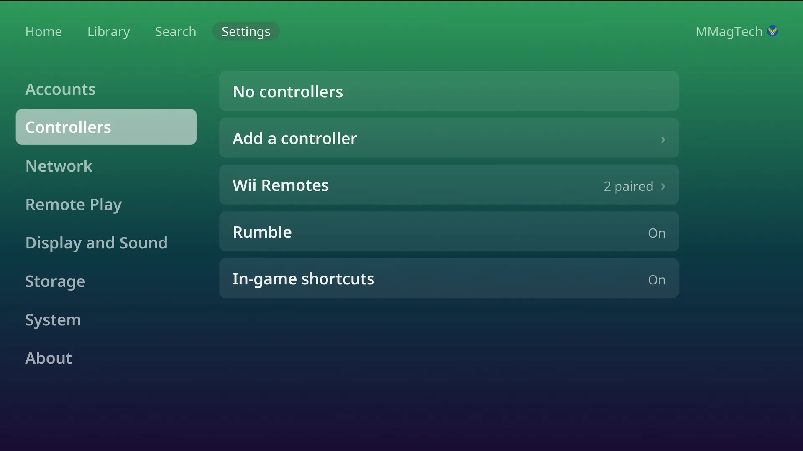

# Controllers and Bluetooth

## Which controllers work

Any pad in the [SDL controller list](https://github.com/mdqinc/SDL_GameControllerDB)
works with no setup, over Bluetooth or USB; the list holds over two thousand
pads. The list arrives with each update. There is no
button-mapping screen; buttons are matched by position, so the bottom face
button is always **A** (Cross on PlayStation, B on Nintendo).

Wii Remotes have their own pairing, below.

## Pair a Bluetooth controller

1. Settings, Controllers, **Controllers**, **Add a controller**.
2. Put the controller into pairing mode (see its manual).
3. Its name appears in the list. Press **A** on it. *Paired successfully. Press
   a button on it.*
4. Press any button on the new controller. The console says which player it is.

A wired pad needs nothing: plug it in.

## Players

Up to **four players**. Each controller takes the next free number as it
connects. In a game, a controller that switches off keeps its place (and the
game pauses until any pad resumes it).

Settings, Controllers, **Controllers** lists each controller with its player.
Press one for:

- **Make player N**: swap numbers (not during a game).
- **Forget**: unpair a Bluetooth controller.

Every controller plays as the person signed in. See
[Players and accounts](players.md).

## Batteries

The top bar on Home, the Library, Search and Settings shows each wireless
controller's battery (**P1** to **P4**, Wii Remotes **W1** to **W4**), with a
bolt while charging. A notice says when one runs low.

## Rumble

Settings, Controllers, **Rumble**: on or off for every controller and every
system. It is on to start with.

## Wii Remotes

Real Wii Remotes play Wii games, pointer included.

1. Settings, Controllers, **Wii Remotes**, **Pair a Wii Remote**.
2. Press the red **sync** button on the Remote (under the battery cover).
3. *Wii Remote paired.* After the first one, the console asks where your
   **sensor bar** is: above or below the TV.

In the menus a Wii Remote held upright works like a pad: the d-pad moves, **A**
selects, **B** (the trigger) goes back, **+** is Start. It switches itself off
after five minutes untouched outside a game.

Wii games that need a Remote are greyed (*Needs a Wii Remote*) until one is
paired. In a Wii game, hold the Remote's **HOME** button for a second for the
console's pause menu; a short press is the game's own HOME menu.

## In-game shortcuts

Off to start with. Turn on **In-game shortcuts** in Settings, Controllers, and
the Home (Guide) button gains shortcuts for save states, rewind, fast forward
and screenshots. See [Buttons and shortcuts](navigation.md#in-game-shortcuts).
