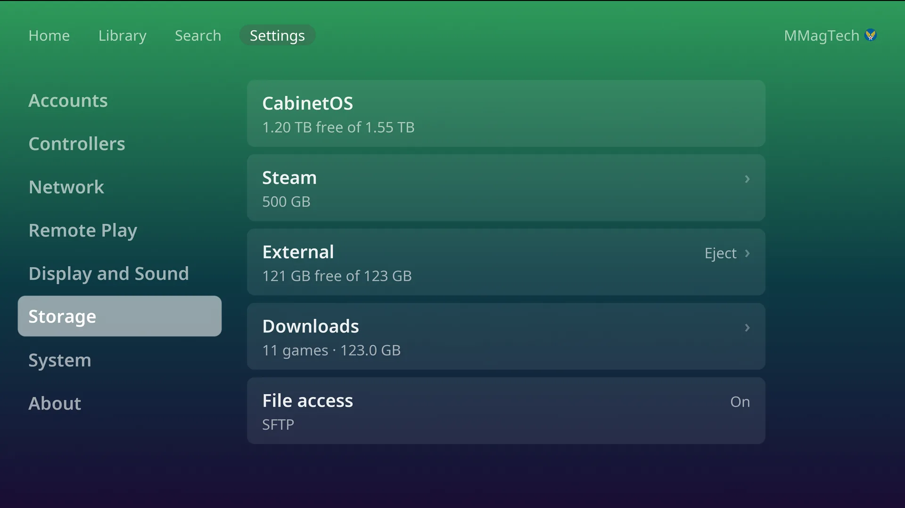

# Drives and storage

## How games are stored

- **Play** on a game that is not on the console fetches it, then starts it.
  Fetched games stay until the space is needed, then the ones played longest
  ago are cleared first, quietly. The game you are playing is never cleared.
- **Download** on a game's page keeps it: it is never cleared, and it plays with
  no server. Downloads are per person: **Remove download** frees the space once
  nobody else on the console keeps the game.
- Downloads go one at a time. The button you pressed becomes the progress bar,
  and a ring on the top bar shows a download from any screen.
- Zip, 7z, rar and gz files are unpacked on the console. CHD and RVZ play as
  they are.

Saves, states, screenshots, BIOS and settings always stay on the console's own
drive.

## Extra drives

**Plug it in and it is used.** A USB drive, or a second internal drive,
formatted **exFAT, NTFS or ext4**, is picked up with no setup. The console makes
one `CabinetOS` folder on it and touches nothing else.

- Downloads fill the console's own drive first. Once downloaded games take 80%
  of it, new downloads go to the extra drive with the most room.
- Unplugging a drive hides its games. Pressing Play on one fetches it again.
- **Eject** (on the drive's row) before unplugging a drive in use. *Safe to
  unplug* means done.

## Format a drive

A blank drive, or one in another format, shows on its row in Settings, Storage.
**Format** erases the whole drive and makes it one ext4 drive named *Games*.

1. The PIN, if one is set.
2. *Format this drive?* with its name, size and what is on it. **Cancel** is
   picked to start with.
3. Type the four-digit code the TV shows. This is the last chance to stop.

Format is not offered for the console's own drive, or for a drive that already
holds a `CabinetOS` folder with files in it.

## Downloads, for everyone

Settings, Storage, **Downloads** (behind the PIN) lists every downloaded game on
the console, by system, largest first. Remove them one system at a time, a few
at a time, or all at once. This removes them for every person on the console.

## When space runs out

- A Download that does not fit says how much more space it needs.
- *Storage almost full* appears after a download when less than 10% is left.
- The console keeps a reserve for itself and for saves that downloads cannot
  use.
