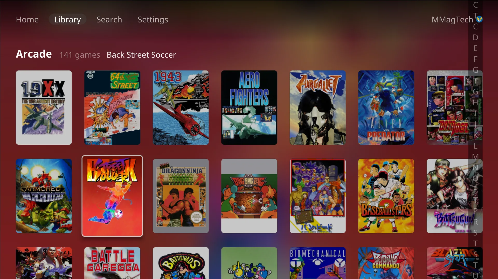

# The library

Four places along the top bar: **Home**, **Library**, **Search** and
**Settings**, with the signed-in person on the right. **L1** and **R1** move
between them from anywhere.

## Home

- **Recent**: the last 16 games you played. The first one says **Resume**:
  pressing it starts the game straight away, from its newest save state where
  the system has them.
- **Favorites**: the games you gave a heart. It only appears once there is one.
- The focused game's cover fills the background.
- A small cyan dot on a cover means the game is downloaded.

Every other cover opens the game's page.

## Library

- **Platforms**: one tile per system on your server, with the number of games.
- **Collections**: your RomM collections.

A system whose emulator is still being set up shows greyed, with *Emulator not
installed*. A system the console does not play has no tile; its games still
show in Search.

## A system's games

Games are in RomM's title order. **L2** and **R2** jump to the previous or
next letter, and the index on the right shows where you are. Games that need a
controller nobody has paired (a Wii Remote, a Wii U GamePad) are greyed and
listed last.

## A game's page

- The year, maker, number of players and how long you have played it.
- **Play**, with when the game was last saved.
- **Download** or **Remove download**. See [Drives and storage](drives.md).
- The **heart** (press Up from Play) adds it to Favorites.
- The **trophy** (beside the heart) lists its achievements, when you are signed
  in to RetroAchievements. It turns gold when you have them all.
- **Continue from** (press Down): your three newest save states, each with a
  picture and when it was made. Press one to play from that moment.

## Search

Type on the on-screen keyboard and results appear as you go. **Start** (or
**done**) moves into the results; **B** goes back to Home.

## Offline

When the RomM server cannot be reached, the top bar says **Offline** and the
console carries on with what is already on its drive:

- Recent, Favorites, Library and Search show the games on the drive, downloaded
  or fetched before.
- Saves made while offline wait and go up when the server is back. The console
  checks again every few seconds at first, then every minute.
- A game the console has never seen online cannot be shown.

At start-up the console waits for the server for 15 seconds, then goes offline
if it has games to offer. **A** on the waiting screen changes the server
address.
