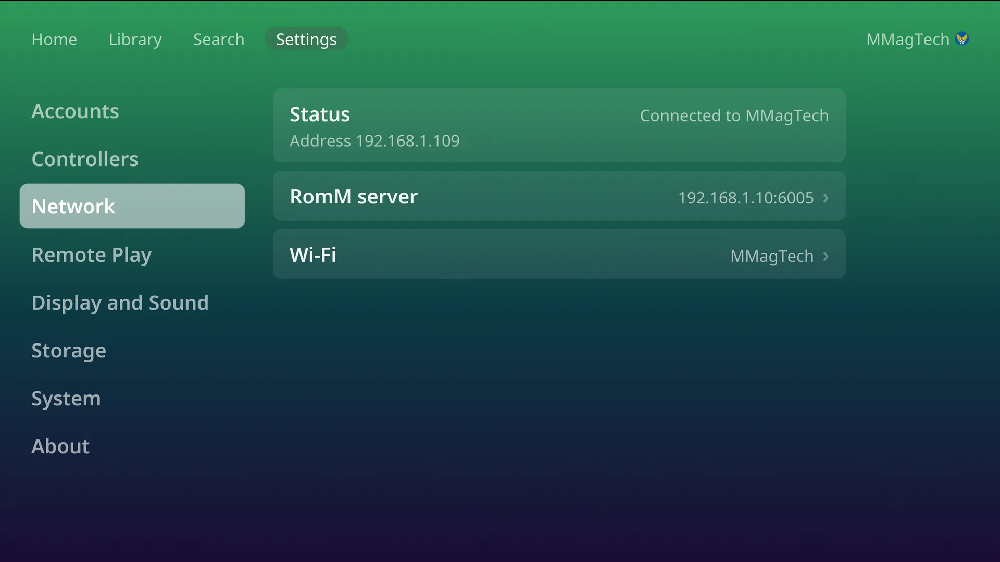

# Wi-Fi and network

Settings, **Network** shows how the console is connected, its address, and your
RomM server.

- **Ethernet always wins.** With a cable plugged in, the console uses it, and
  Wi-Fi stays set up as a fallback.
- **Wi-Fi** appears when the PC has a Wi-Fi radio.

## Join or change a Wi-Fi network

Settings, Network, **Wi-Fi** (behind the PIN if one is set). If Wi-Fi is off,
pressing the row turns it on. The list shows the networks in range:

| Network | Pressing it offers |
|---|---|
| The one you are on | **Change password**, **Forget** |
| One you have joined before | **Join**, **Change password**, **Forget** |
| Any other | Joins it, asking for the password first if it has one |

Passwords are typed on the [on-screen keyboard](navigation.md#the-on-screen-keyboard)
or a USB keyboard.

## Not supported

- **Hidden networks.** Make the network visible to join it.
- **802.1X** networks (a user name and a password, common in offices and
  schools). They are left out of the list.

## The RomM server row

See [Your RomM server](romm.md#changing-or-leaving-the-server).
