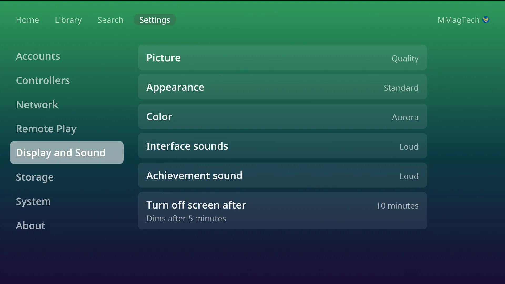
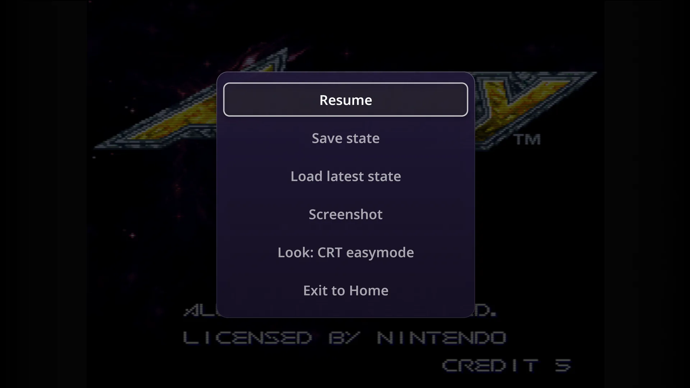

# Picture and colours

## Resolution

The console runs at the TV's own resolution, 4K included, and turns on variable
refresh rate when the TV offers it. Every game fills the height of the screen at
its own shape, with a soft glow in the bars at the sides.

## Picture level

Settings, Display and Sound, **Picture**: **Performance**, **Balanced** or
**Quality**. One setting for every system; it sets how sharply the 3D systems
render. The console starts on the level its graphics chip suits.

| System | Performance | Balanced | Quality |
|---|---|---|---|
| PSP | 480x272 (original) | 1920x1088 | 3840x2176 |
| PS2 | 1x | 3x | 4x |
| GameCube | 1x | 3x | 6x |
| Wii | 1x | 3x | 5x |
| Nintendo 64 | 1x | 2x | 4x |
| Dreamcast | 640x480 | 1440x1080 | 2880x2160 |
| Switch | 1x | 1x | 2x |
| PS3 | 100% | 150% | 150% |
| Xbox | 1x | 2x | 4x |

A single game can have its own level: **Picture** in the
[pause menu](pause-menu.md), from the next start. With a PIN set, only the owner
sees either setting.

## Screen looks

<video src="../media/looks.mp4" poster="../media/looks-poster.webp" controls muted loop playsinline preload="none"></video>

**Look** in the pause menu sets how a system's picture is drawn. It changes
behind the menu as you choose, and the choice is kept for that system.

| Systems | Looks | Starts on |
|---|---|---|
| NES, SNES, Genesis, Master System, Sega CD, 32X, TurboGrafx-16 and CD, Atari 2600 and 7800, arcade, PlayStation, Saturn | Plain, Sharp, CRT easymode, CRT easymode halation, CRT lottes, CRT geom, CRT zfast, CRT aperture, CRT guest | CRT easymode |
| Nintendo 64, Dreamcast, 3DO | Plain, Sharp, CRT easymode, CRT lottes, CRT aperture | CRT easymode |
| Game Boy Advance, Game Gear, Neo Geo Pocket Color | Plain, Sharp, LCD 3x, LCD grid, LCD zfast | LCD 3x |
| Game Boy | as above, plus Dot matrix and Dot matrix Pocket | LCD 3x |
| Game Boy Color | as above, plus Dot matrix | LCD 3x |

The looks are RetroArch's own shaders. PS2 and newer, DS, PSP, Virtual Boy and
Vectrex have no Look row.

Two systems have a row of their own in the pause menu:

- **Virtual Boy, Screen:** Red, White, Blue, Cyan, Electric cyan, Green,
  Magenta, Yellow, and five 3D glasses pairs (red/blue, red/cyan, red/electric
  cyan, green/magenta, yellow/blue).
- **Game Boy, Colors:** Off, Auto, Game Boy Color, Super Game Boy.

## Colours

<video src="../media/colours.mp4" poster="../media/colours-poster.webp" controls muted loop playsinline preload="none"></video>

Settings, Display and Sound, **Color**: Purple, Blue, Teal, Green, Amber, Red,
Wine, Graphite, and the bright ones, Pink, Sky, Lime, Orange, and the
gradients, Sunset, Ocean, Aurora and Fire. Press Left and Right to change it;
the console fades to it as you go.

Each person has their own colour, and the console changes when they sign in.

## Appearance and dark hours

**Appearance**:

- **Standard**: the normal look.
- **Dark**: darker menus for the evening. The games are not changed.
- **Scheduled**: Dark during the **Dark hours** you choose (8 PM to 7 AM to
  start with), by the time zone picked at install.

## Screen off

**Turn off screen after**: 10, 15 or 30 minutes. In the menus the screen dims
after 5 minutes and turns off at the time chosen; the first press after that
only wakes it. A game being played dims after 20 minutes and never turns the
screen off. The picture also moves by a pixel or two every few minutes, to be
kind to OLED TVs.

## Sound

**Interface sounds**: Off, Quiet, Medium or Loud, for the menu sounds. Game
volume is the TV's.
