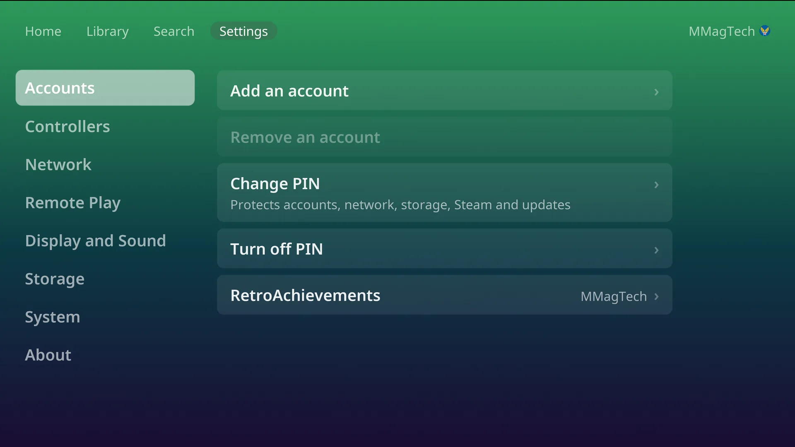

# Players and accounts

Two different things:

- **Accounts** are people. Each one is a user on your RomM server, with their
  own saves, states, favourites, play time, achievements and colour.
- **Players** are controllers: player 1 to 4. See
  [Controllers](controllers.md#players). Every controller plays as the account
  signed in.

## Add a person

1. Settings, Accounts, **Add an account** (the PIN, if one is set).
2. A QR code appears. *Sign in as the person you are adding, not as yourself.*
   On their phone, sign in to RomM as them and approve the console.
3. They are added. The console stays on whoever was signed in.

Each person needs their own RomM user. Create them in RomM first.

## Switch person

Press Up to the top bar, move to the name on the right and press **A**. Pick
someone from the list. Switching to the owner asks for the PIN.

The console starts as whoever played last. Switching works offline too. It
waits while a save is still uploading.

## Remove a person

Settings, Accounts, **Remove an account**. Their saves are sent to RomM first.
If any cannot be sent, the console says so before removing them. The owner and
the person signed in cannot be removed. Removing someone only removes them from
this console, not from RomM.

## The owner and the PIN

The first person paired is the **owner**. Only the owner can set a PIN: four
digits, entered on a number pad on the TV. It is off to start with.

With a PIN set, it is asked before:

- adding or removing an account, and switching to the owner,
- changing Wi-Fi or the RomM server,
- formatting a drive, opening Downloads, or File access and Developer access,
- installing an update,
- turning on Remote Play, pairing a device, or changing Tailscale,
- using, changing or showing Steam,
- the Picture setting, which only the owner sees.

It is asked once per visit to Settings. Five wrong tries lock the pad for 30
seconds. There are no age ratings.
