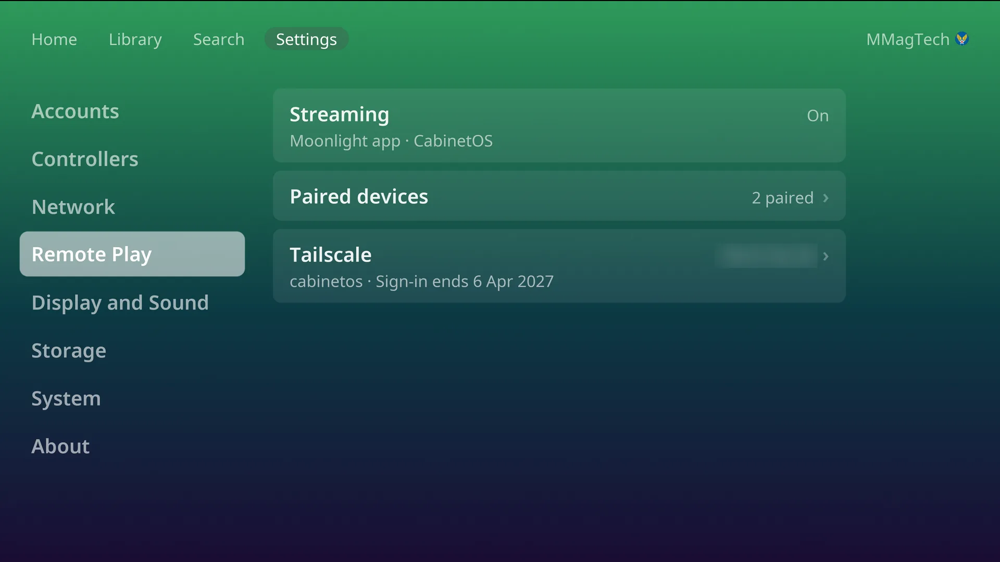

# Remote Play

Play the console from a phone, tablet or computer with
[Moonlight](https://moonlight-stream.org). The whole console streams: Home, the
Library, every game. The device's controller (or its touch controls) becomes
player one while it is connected.

Remote Play is off to start with, and nothing listens on the network until you
turn it on.

## Turn it on

Settings, **Remote Play**, **Streaming** (the PIN, if one is set). The row then
reads *Moonlight app · CabinetOS*: CabinetOS is the name Moonlight shows.

## Pair a device

1. Install Moonlight on the device, on the same network as the console.
2. In Moonlight, pick **CabinetOS** (or add it by the console's address, from
   Settings, Network). Moonlight shows four digits.
3. The TV opens a number pad by itself: *Pair a device. Enter the code from
   Moonlight.* Type the four digits.
4. Name the device on the TV's keyboard. *Paired with ...*.

**Paired devices** lists them; press one to rename or remove it. Pairing does
not open while a game is being played on the TV.

## While a device is streaming

- The device takes over the players, and a game being played on the TV pauses.
- **Hold Select** on the device's controller for the console's
  [pause menu](pause-menu.md), in every game.
- The Remote Play section in Settings is greyed, marked *In use*.
- Wii games that need a Wii Remote cannot be played from a device.
- The quality (resolution, frame rate, codec) is set in Moonlight, not on the
  console.

## Away from home: Tailscale

[Tailscale](https://tailscale.com) lets a device reach the console from
anywhere without opening your router.

1. Install Tailscale on the device and sign in.
2. Settings, Remote Play, **Tailscale** (Streaming must be on). Scan the QR code
   with the device: *Use the Tailscale account your phone is signed in to.*
3. The row shows the console's Tailscale address. Add that address in Moonlight.

Only Remote Play's ports are open over Tailscale. The sign-in lasts until the
date shown under the row; **Sign in again** appears near the end.

## Streaming Steam

Steam's Big Picture streams too, after **Switch to Steam** (see [Steam](steam.md)).
Steam's screen is in HDR: turn on **HDR** in Moonlight's settings, or Steam looks
washed out on the device.
