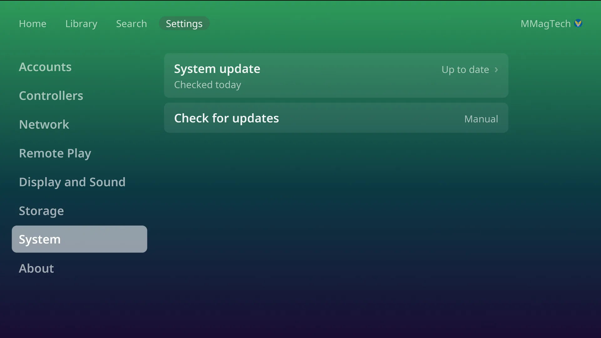

# Updates

CabinetOS updates as one piece: the system, the console and its emulators
arrive together as a single image, so they always match. (Eden and xemu come
from Flathub, at the versions the image names.) A small change downloads small.

## Update the console

Settings, **System**, **System update**.

1. The row checks and says *Up to date* or *Update available*, with the new
   version and its size.
2. **Download** (the PIN, if one is set). The row shows the progress, then
   *Installing...*. You can keep playing meanwhile.
3. *Update ready*: **Restart now**, or **Later** to have it apply at the next
   restart or power off.

After the restart a notice says *Updated to ...*. If it says *Update didn't
apply*, the console is still on the version it had, and works as before.

**Check for updates**: **Manual** (the start) or **Weekly**. Weekly only
checks, on Home with no game running; downloading is always your choice.

The version is in Settings, **About**: the console's version, and the
[Bazzite](https://bazzite.gg) version it is built on.

## The installer

An installed console never needs the installer again: it updates itself from
GitHub's container registry. A new USB stick is only needed to install another
console.
